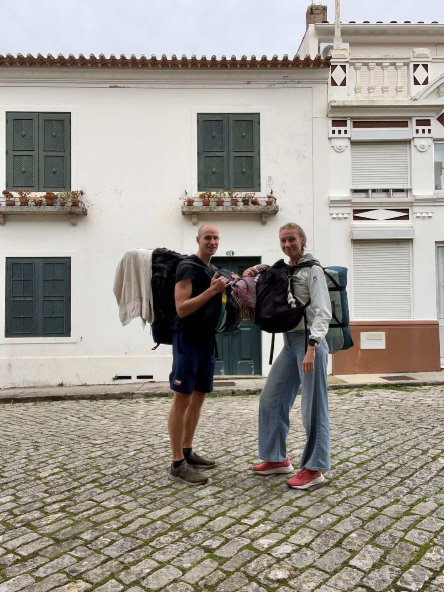
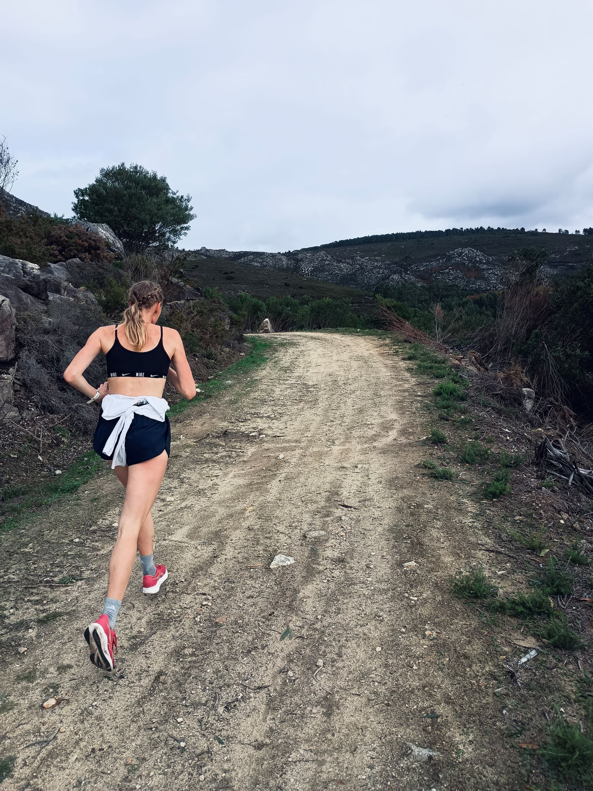
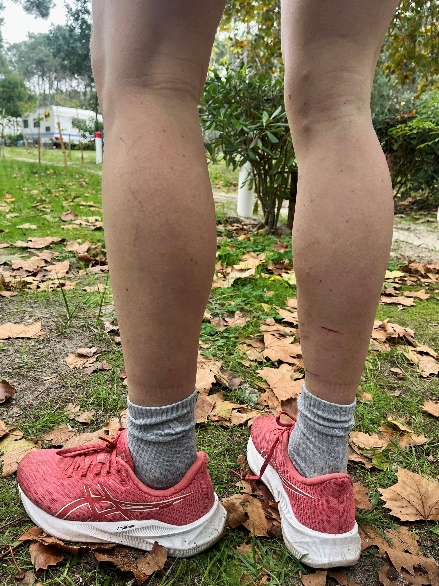
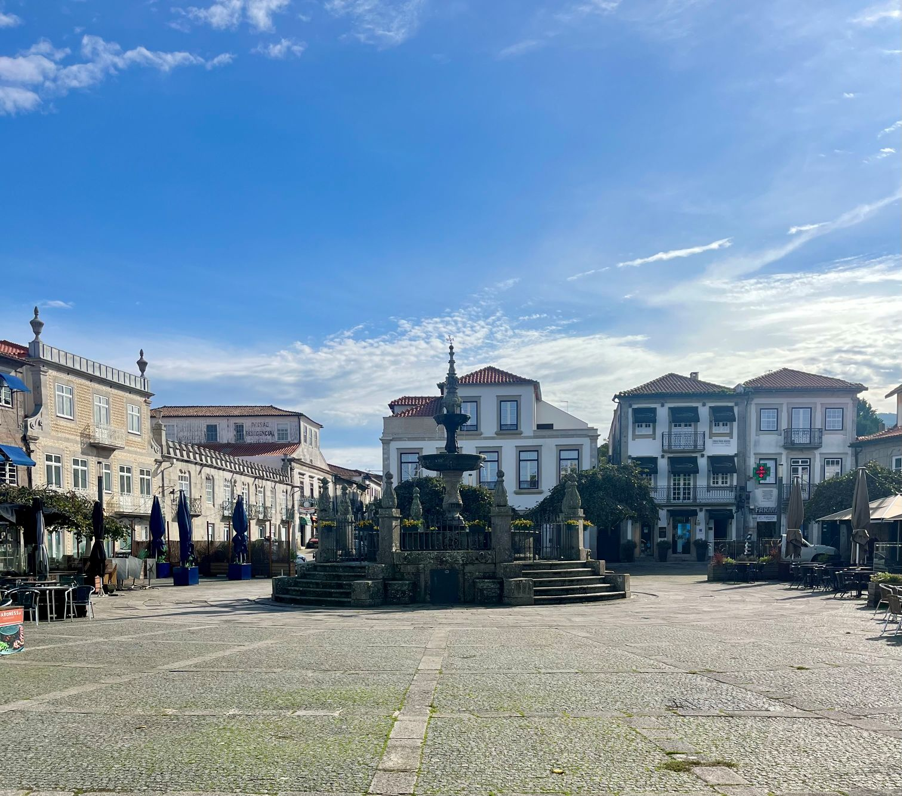
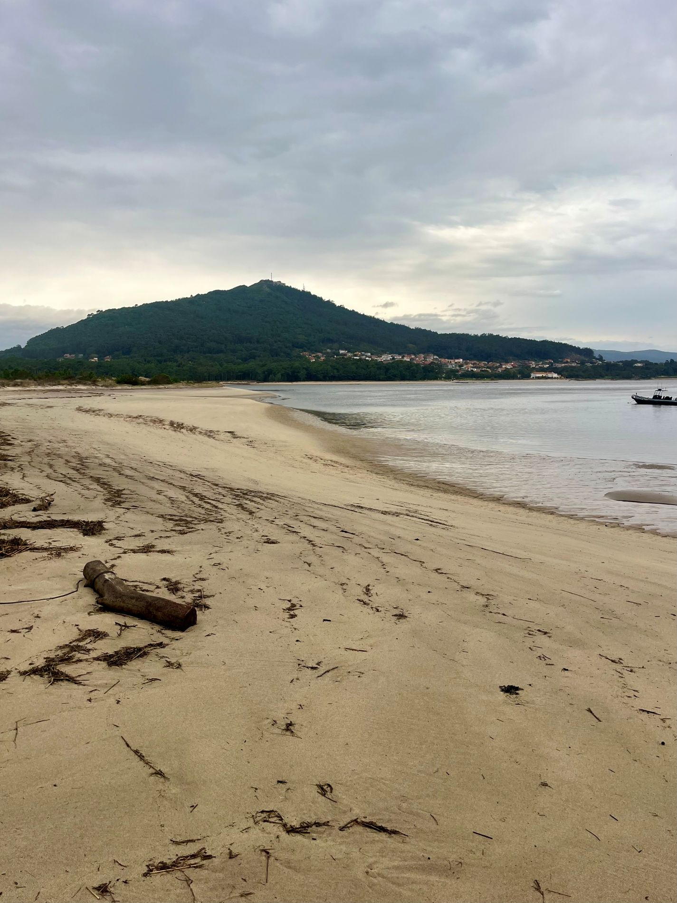

Listopad začal výpravou do kempu na úplném severu Portugalska, kde jsme strávili čtyři noci pod stanem. Při plánování našeho výjezdu došlo totiž k takovému drobnému nedopatření, že mezi termíny prvního a druhého ubytování byly čtyři plonkové noci. Naštěstí jsme už první týden v Portu potkali novou česko-portskou kamarádku Páju, která sama kempování měla moc ráda. Vyřešit tyhle naše dny bez střechy nad hlavou stanem byl vlastně její nápad. Navíc byla tak báječná, že nám napůjčovala vše, co jsme potřebovali. A tak jsme její velkorysost přijali. Své kufry jsme nechali na čtyři dny kempovat u Páji v kumbálu, a my sami se vydali s plnou polní kempařskou vlakem do městečka Moledo. Pájin stan byl spíš takový plachtový palác, takže se společně s nafukovacími karimatkami, spacáky a tou troškou našich osobních věcí docela pronesl. Naštěstí to z vlakového nádraží v Moledu bylo do kempu jen necelé 3 kilometry, takže jsem to přijala jako další osobní výzvu. Šlapala jsem tak dlouho, dokud jsem dva batohy neshodila v recepci kempu.

Pro mě to byl velký a nový zážitek. Nikdy dřív jsem neexistovala několik dnů v kuse jen pod plachtou. Jsem na tohle trochu citlivka – společné sprchy s betonovou podlahou? Fuj. Jezení z jednoho ešusu? Fuj. Sezení na plachtě, která je celá od písku a bláta? Fuj. Ke svému údivu jsem to ale opět zvládala dobře a velmi rychle si zvykla. V pojídání fazolí s párkem z jednoho ešusu jsem dokonce našla zálibu. Už jsem si začala plánovat, co vše si také musím pořídit, abych tyhle výlety mohla opakovat pravidelněji. Kemp leží hned u pobřeží, opravdu na samém konci Portugalska. Přes řeku Rio Minho ústící do moře, je vidět přímo na Španělsko (pokud zrovna není mlha – a ta byla na podzim často). Pobřeží je porostlé krásným borovým lesíkem a v okolí je spoustu zelených kopců. Opravdu tam bylo krásně. Tedy až na poslední noc, která byla přímo děsivá a mou novou zálibu v kempování zase trochu podryla.

Jelikož se kemp nachází na severu a přímo u pobřeží, jdou sem od Atlantiku silné poryvy větru a s nimi často také bouřky. Přesně takové počasí mělo přijít i poslední noc našeho kempařského dobrodružství. Byla to asi daň za krásné počasí a klidné noci, na které jsme měli štěstí všechny ostatní dny. Každopádně jsme to z předpovědi zjistili dost dopředu, a tak se strhla menší bouře i mezi mnou a Honzou. Jejím spouštěčem byl můj požadavek zabalit stan a na poslední noc si doplatit bungalov, který v kempu také pronajímají a který, na rozdíl od našeho krásného propůjčeného stanu, nemůže jen tak uletět. Honza ale tvrdil, že utíkat jako tramp před počasím a vzdát stanování jen kvůli dešti a větru je srabáctví. Protože jsem protivná fňukna a Honza má měkké srdce, podařilo se mi, s přihlédnutím na předpověď 75 km/h silného větru a 15 mm srážek, prosadit svou, a šla jsem nám domluvit bungalov. Jelikož jsem ale v jádru také dobrodruh, a navíc celý den byl krásný a slunečný, nakonec jsem z bungalovu ustoupila a dohodli jsme se, že si stan pořádně zajistíme a upevníme – balvany a provázky – a riskneme to. Paní z recepce kempu, které jsem šla později říct, že jsme si to nakonec rozmysleli, si o nás musela myslet, že jsme praštění blázni, anebo minimálně něčím praštění budeme po téhle noci ve stanu.

Noc byla opravdu divoká a já byla chvílemi vzteky běsná a chvílemi strachy uplakaná. Nejprve přišel silný vítr, který zmítal stanem tak, že se třepal jako igelitový pytlík. I v téhle děsivé situaci měl Honza odvahu se mi zasmát, když jsem se rozhodla v nejhorších větrných nárazech rukama podpírat střechu stanu zevnitř. Jen co se vítr trochu uklidnil, začalo silně pršet. Bála jsem se, že nám do předsíňky, která nebyla celistvě uzavřená a jejíž podlaha byla v podstatě jen plachta položená na zemi, poteče voda. A protože jsme měli v předsíňce většinu svých věcí, přesunuli jsme si některé do spací místnosti stanu a některé jsme naskládali na židli, kterou jsem si bez dovolení, ale zcela sebejistě, půjčila u jednoho z bungalovů. Přesto jsem nechtěla, aby nám do stanu proudila voda a my ho pak vezli zpět Páje promočený i zevnitř. Několikrát za noc jsem měla pocit, že slyším, jak se proud vody prolévá stanem, a vystrčenou rukou ze spací místnosti do předsíňky jsem to kontrolovala, ačkoliv netuším, co bych dělala, kdyby nám tam voda opravdu tekla. Naštěstí jsem se ale pletla a stan zůstal zevnitř úplně suchý. Pak už přišlo jen pár hromů a blesků, jež následovaly moje zděšené výkřiky, a vše bylo za námi. Ráno dokonce i na chvíli přestalo pršet, a tak jsme stan rychle sbalili, trochu vysušili ručníkem a nechali se odubrovat (≈ odvézt ubrem) na vlakové nádraží.

Aby to ale zase nebylo jen vyprávění nejhrůznějších zážitků, musím napsat, že kromě téhle naší poslední noci byl čas v kempu asi tím nejlepším z celých tří měsíců v Portugalsku. Zrovna té době jsem se zatoužila sportovně trochu přeorientovat a začít běhat dlouhé tratě po horách a lesích. Tady jsme k tomu měli ideální příležitost, a tak jsme se jí hned druhý den chopili. Zkušený mapař Honza naplánoval 20ti kilometrovou trať v okolí přes jeden z těch krásných, lesem pokrytých kopců. Pak běžel se mnou s telefonem v ruce, aby mi mou novou zkušeností udělal průvodce. Bylo to skvělé a já si to moc užívala, především prvních 10 kilometrů. Po jedenáctém na mě dopadala trochu krize. To mě trochu překvapilo, jelikož už jsem předtím uběhla 15ti km trať a takovou únavu jsem nepociťovala ani ke konci. Pravděpodobně se únava dostavila dřív, protože terén byl nejen hodně kopcovitý, ale částmi také těžce zarostlý, a člověk se tu musel probit trním a křovinami. A tak jsem si z cesty donesla i pěkně poškrábané nohy. Protože mi ale nic jiného nezbývalo, a taky protože kromě bolavých nohou to bylo báječné, jsem celou trať doběhla a byla jsem za to na sebe nesmírně pyšná. Ležet si pak ve spacáku a cpát se fazolemi bylo o to příjemnější.

Den po mém novém osobáku v uběhnuté vzdálenosti jsme se vlakem vydali na výlet do města Viana do Castelo. Tenhle výlet byl, dá se říct, mou povinností, jelikož je to druhý domov mé nejlepší kamarádky, která tady sama strávila šest měsíců. My jsme ale bohužel byli z předchozího dobrodružství tak vyčerpaní, že jsme město neprozkoumali ani zdaleka tak, jak by si zasloužilo. Především krásný chrám na kopci Mount of Santa Luzia mě zamrzel. Víc jsme prozkoumali město Caminha, které bylo kousek od našeho kempu a je důležitou součástí Svatojakubské poutní cesty - zejména pro Portugalce. Všude v městečku jsme naráželi na značky mušliček, které poutníky při téhle cestě provází, a také na přemrštěné ceny, které poutníky připravují o peníze – což bude asi hlavní duchovní očistou této poutě. I tohle městečko bylo obyčejné. Hezké, ale ničím výjimečné, pokud si v něm sami nějakou silnou a výjimečnou vzpomínku nevytvoříte. Protože jen to dělá cestování tak obohacujícím.

