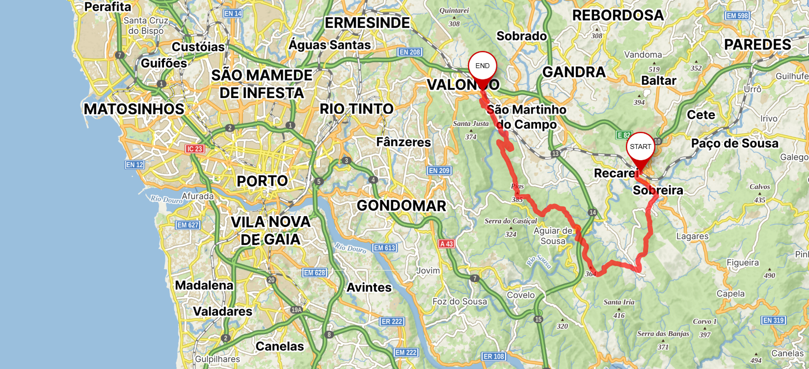
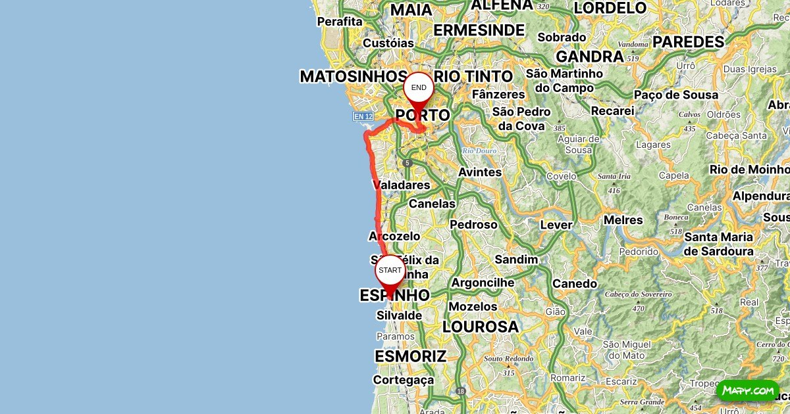

Druhý měsíc našeho portugalského dobrodružství se převalil jako vlna z Atlantského oceánu, a i my se v prosinci přesunuli zase do jiné části Porta. Tentokrát jsme se usídlili přímo v jeho srdci.

<figure style="display: flex; flex-direction: column; align-items: center; text-align:center; gap: 0.5em;">
  
  <figcaption>
Ponte de Luis 
  </figcaption>
</figure>

Porto je velmi živé město, a tak jsem se trochu bála, jak bude život v jeho centru vypadat a jak v něm budu umět fungovat. Ale zároveň jsem se na to i těšila. Zase si vyzkouším něco úplně nového a třeba se něco užitečného naučím. Například odmítnout nabídku marihuany. Prodavači těhle kuriozit tam na nás dělali nálet docela pravidelně.  Mě to obvykle trochu vykolejilo. Zato Honzova taktika se ukázala jako poměrně funkční. Na otázku, zda chcete nějakou kuriózní zálrežitost, byste prý neměli přímo odpovídat, že nechcete. Může se totiž stát, že vás prodejce začne přesvědčovat. Místo toho řekněte, že kouzelného materiálu už máte dostatek. V našem případě to týpek očividně zbaštil a s poněkud šokovaným pokýváním se odporoučel.

Ubytování pro náš poslední měsíc jsme našli v činžáku na křižovatce poměrně rušných, oblíbených ulic. Kavárnami, restauracemi, obchůdky a všemožnými studii byla tahle čtvrť přecpaná. Je asi jasné, že lidmi se to tam také jen hemžilo. My, zvyklí na klid a ticho z vesnice, jsme se připravili na divokou párty, každý večer hrající nám pod okny. Měla jsem ale šťastnou ruku při výběru. Byt, ve kterém jsme bydleli, byl obrácen do „vnitrobloku“. Do vnitrobloku, ve kterém ale nebyly ani žádné dvorky či jiné obyvatelné prostory. Prostě tam bylo mrtvo a drahocennou výhodou toho bylo ticho. Z rušných ulic, na které jsme z činžáku vycházeli, nebylo slyšet téměř nic.

Centrum Porta bylo v prosinci opravdu bohatě vánočně nazdobené. Pro mě ale tenhle měsíc nebyl vůbec sváteční. Vánoční období mě neovlivnilo, tedy až na to, že se mi začalo trochu stýskat. Už během prvního prosincového týdne jsem si uvědomila, že je to vůbec poprvé, co se mi tu opravdu stýská. Je to zvláštní, ale když jsem už od začátku věděla, že je moje odloučení jen dočasné, stesk po domově se dlouho neprojevoval. V prosinci jsem měla svátek a mamka mi nechala doručit krásnou kytičku. Když jsem se v bytě probírala hrnci a miskami, abych našla to, co z dostupných kusů nádobí nejvhodněji nahradí vázu, vzpomínala jsem, kolik lidí, kterým na mě záleží, jsem doma zanechala.

<figure style="display: flex; flex-direction: column; align-items: center; text-align:center; gap: 0.5em;">
  
</figure>

Ačkoli pro nás vánoční období zapadlo mezi běžné dny, můj portugalský šéf se hodil do prázdninového módu hned začátkem prosince. Tedy, ne že by to jiné měsíce bylo v mé portugalské práci nějak žhavé. Ovšem v prosinci pracovní nasazení téměř vyhaslo. Jeden prosincový den probíhala v Portugalsku celonárodní stávka státních služeb. Nejezdila tedy hromadná doprava a byly zavřené úřady. Ačkoliv můj šéf je podnikatel a státní stávka by se ho nejspíš nemusela téměř dotknout, rozhodl se k ní přidat a také nepracovat. Možná jsem se neměla ostýchat zeptat, proč nepracoval, když není řidičem tramvaje, a dozvěděla bych se něco zajímavého.

Tohle jsem si ale nejspíš mohla uvědomit už dřív. Zprvu jsem nedala na předsudky o jižanech a jejich pracovní morálce. Juan, můj portugalský šéf, se poměrně čile chopil toho, aby mě zaúkoloval. Ovšem časem se ukázalo, že nemá přehled o tom, co sám dělá, natož aby si pamatoval, co jsem měla udělat já. Ačkoliv mi několikrát zopakoval větu „I am always working“, dokázal si během naší jednohodinové working session dát dvě pauzy na cigárko a další dvě na kafe.

My jsme alespoň měli proctor udělat si v prodinci víc výletů.
Poprvé jsme vyjeli na túru do Sobreiry, odkud jsme došli 26kilometrovou trasou do Valonga a odtamtud zase vlakem zpět do Porta. Cesta vedla nejprve eukalyptovými lesy. Dočetla jsem se, že eukalyptus se v Portugalsku používá především pro výrobu papíru, což jsme si podle jeho pronikavé vůně vůbec netipovali. Každopádně je to také rozpínavá potvora, která se hodně rychle šíří, a tak nás stromy doprovázely téměř celou cestu. V části túry jsme procházeli také přes úplně zčernalé kopce, celé spálené a pokryté ohořelými pahýly kmenů. Napadlo mě, jestli tohle zemědělci nedělají naschvál, aby se zbavili eukalyptu. Naše portská kamarádka nám ale vyprávěla o požárech, které tu v létě dost často krajinu sužují. Bylo to jako procházet krajinou v nějakém apokalyptickém scénáři.

.jpeg>)
.jpeg>)

Další apokalyptický scénář jsem si prožila, když jsme se vrátili do Valonga podruhé. Jelikož jsem si po své první uběhnuté dvacítce předsevzala, že budu tuhle šílenost podstupovat pravidelně každý měsíc, naplánoval Honza další krásnou trasu v portugalských kopcích - právě ve Valongu. Trasa to byla vskutku krásná, jen trochu nad moje síly. Šplhání přes balvany a sbíhání skal jsem nezvládala úplně udýchat ani ustát. Když jsem doškobrtala na konec trasy, zjistili jsme, že vlak, kterým jsme původně doufali odjet domů, nestihneme. Nepřekvapivě jsem se totiž kňourala, že další kilometr a půl na vlak neběžím. Na druhou stranu se sama sebe musím tentokrát zastat, protože jsem si připadala jako účastník z filmu The Long Walk a raději se nechala zastřelit, než abych svoje nohy nutila k dalším kilometrům.
Protože sluníčko ještě ani zdaleka nehřálo natolik, aby se člověk mohl spotit jako prase a pak čekat hodinu a půl na vlak, šli jsme se ohřát a občerstvit na benzínku. Proč zrovna tam, a ne raději do nějaké kavárny? No, nebylo to jen kvůli tomu, že jsme byli zpocení jako prasata, ale především proto, že bylo 25. 12. Tedy první svátek vánoční, a to znamená, že všechno kromě benzínek bylo zavřeno. Po tu dobu, co jsme tam strávili, se ale dveře netrhly. Portugalci si chodili kupovat losy. Ty jsou tu nejspíš vánoční tradice a lidé doufají v zázraky. Největší výhrou, jaká se udála 25. 12. o Vánocích roku 2025 na benzínce ve Valongu, byla suma přesné ceny losu, a ta byla okamžitě směněna za los další. Z toho už bylo klasické prd.

Ani naše Vánoce nebyly ničím zázračné. Vánoce ve dvou byly poněkud smutné, a tak jsme si alespoň udělali další výlet  vlakem. Přijeli jsme do Espinha a odtud podle moře pěšky zpět do Porta. Cesta po pláži byla z velké části vystavěná dřevěným lešením. S drobným přerušováním nás provázely tyhle lávky asi 10 km celé trasy. Odpoledne, když jsme došli do Porta, jsme už byli pěkně hladoví. Ve výloze jedné pekárny jsme si vyhlídli veliký tradiční žloutkový koláč.  A protože hladové břicho klame mysl,  koupili jsme si ho. Žloutkový koláč, portugalsky Pão de Ló, chutnal jako žloutky s cukrem. To je mi ale překvápko. Přesně to totiž je. Dlouho šlehaná vejce, převážně žloutky, se spoustou cukru a trochou mouky. Možná by mi to i chutnalo, kdybych už žloutků za ty tři měsíce neměla dost. Také jsme se chtěli připojit k půlnoční mši. Po tom, co jsem se nacpala žloutkovým koláčem, jsem ale usnula asi v devět hodin. No a to byly naše portugalské Vánoce.

Byla bych možná zklamaná, že jsem je neprožila nějakým jedinečným způsobem, abych se tím mohla chlubit na instagramu. Už jsem si ale uvědomila, že se nezmění celý můj živto jen protože změním místo.

Pět dnů po Vánocích jsme se vraceli domů. Už jsem se opravdu těšila, ale současně jsem měla z návratu i obavy. Přeci jen tohle byl můj velký odvážný krok. Ačkoli se mi od začátku zdálo, že se tím nic nezměnilo, pořád jsem se k odjezdu z domova na 3 měsíce musela odhodlávat. Něco mě k tomu dotáhlo, něco ve mně po tom asi moc toužilo. Něco co si třeba teď ještě neuvědomuju, ale začne se mi to odkrývat. 
A tak to i skutečně bylo. V den, kdy jsme odjížděli a stáli na ulici před naším bytem, se mi začaly po tvářích ronit slzy.

Přínosy a uvědomění třetího měsíce:
- zkouška ohněm funguje, ale je lepší nebýt v tom úplně sám
- doma je nejlíp, musíš ale občas vypadnout aby sis to připomněl
- první krok do neznámá je nepříjemný, ale s každým dálším budeš sebejistější, a to i když nevíš kam tě kroky vedou 
- smiř se s tím, že ne všechno půjde vyřešit hned
- jestli je ti ouvej zvedni se ven padej 

